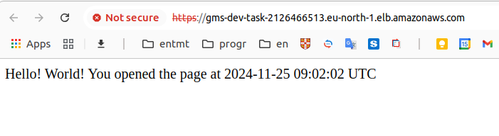

# GMS Task

In this repository, you can find a simple Python application and a Terraform configuration that deploys this application to AWS.

The infrastructure components are:

* VPC with private and public subnets
* Application LB in public subnet running on HTTPS port (self-signed certificate is used)
* EC2 instance in private subnet
* RDS multi-az cluster in private subnet
* Security groups to control access to ALB, EC2 and RDS
* ECR repository for Docker images
* [SSM Run Command feature to provision Kubernetes Cluster with the help of Ansible](https://aws.amazon.com/blogs/mt/running-ansible-playbooks-using-ec2-systems-manager-run-command-and-state-manager/)

## Prerequisites

* [Docker 27.3+](https://docs.docker.com/engine/install/)
* [Terraform 1.9+](https://developer.hashicorp.com/terraform/install)

## Preview

1. Dice App

    

## Deployment

1. Go to the folder with Terraform configuration

    ```bash
    cd tf
    ```

2. Configure Terraform configuration ([terraform.tfvars](./tf/terraform.tfvars)) if needed.

   The full list of variables can be found in [tf/variables.tf](./tf/variables.tf)

3. Deploy infrastructure

    > **_NOTE:_**  It takes approximately 15-20 mins to deploy everything (without RDS it takes about 4 mins)

    ```bash
    terraform init && \
    terraform apply -auto-approve
    ```

## Check

1. Get Application URL (you should have seen it in the outputs from the previous step)

    > **_NOTE:_**  It takes approximately 5 mins to provision Kubernetes Cluster with all the resources after EC2 instance is created

    ```bash
    terraform output
    ```

## Cleanup

1. Go to the folder with Terraform configuration

    ```bash
    cd tf
    ```

2. Destroy infrastructure

    ```bash
    terraform destroy -auto-approve
    ```

## Some thoughts

1. The challenge is how to automatically provision/configure something in private EC2 instance with the help of Ansible/Terraform. You cannot use SSH connection because there is no public IP address. I see 2 options:

   * [AWS SSM Run Command feature](https://aws.amazon.com/blogs/mt/running-ansible-playbooks-using-ec2-systems-manager-run-command-and-state-manager/)
   * [AWS Bastion Host](https://dev.to/aws-builders/bastion-host-in-aws-vpc-2i63)

   As I see it, the SSM is easier to implement but Bastion Host is more powerful in terms of flexibility.

2. I have not created multi-stage Dockerfile because there is no build/compile step in Python application.

3. It's okay to use [TF Kubernetes provider](https://registry.terraform.io/providers/hashicorp/kubernetes/latest) for managing Kubernetes Cluster and its "main" components but I don't recommend using it for managing Kubernetes workload resources. Kubernetes API is not good for TF model. I highly recommend [ArgoCD](https://argo-cd.readthedocs.io/en/stable/) for these purposes.
